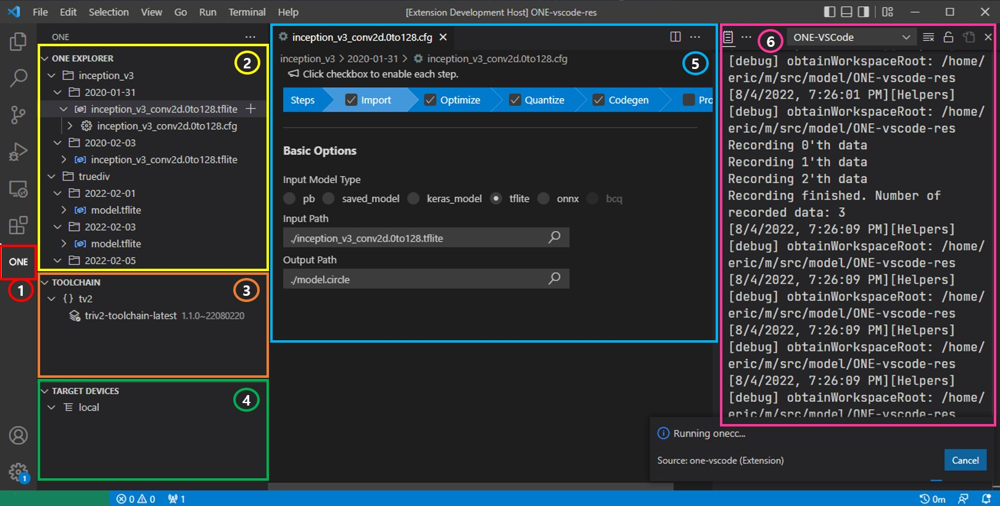

# Screen layout of ONE-vscode

ONE-vscode has 7 screen components.

1. `ONE button`
    - Clicking this will load ONE-vscode extension into vscode
2. `ONE Explorer view`
    - This shows tree view containing models and related files.
        - Model files (e.g., *.tflite, *.pb, *.onnx, etc) are shown in the directory structure.
        - Under each model file, ONE *.cfg that accepts the model file as input will be shown.
        - Under each *.cfg file, any files generated by running `onecc` with the *.cfg will be shown. For example, *.circle file and files after backend codegen.
3. `Toolchain view`
    - This shows installed toolchain.
    - You can also install a new toolchain or uninstall an existing toolchain.
4. `Target Device view`
    - This shows tree view of devices or simulators that can run for inference.
5. `ONE cfg editor`
    - This provides easier way to edit ONE cfg file.
6. `ONE-vscode Log`
    - This shows logs. You can check detailed reason of error or warning.
